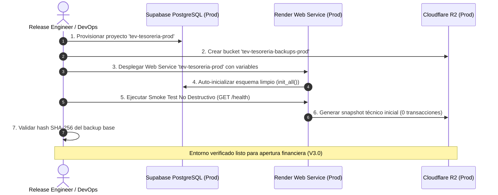

# PROTOCOLO DE ACTIVACIÓN CONTROLADA DE PRODUCCIÓN (V2.9)
## Todo Eléctrico Valencia — Sistema de Tesorería y Flujo de Caja

---

## 1. Alcance y Filosofía de Activación
Este documento detalla el procedimiento de activación controlada de Producción para el Sistema de Tesorería y Flujo de Caja de **Todo Eléctrico Valencia (TEV)**.
- **Objetivo**: Pasar del estado de preparación de infraestructura a un entorno productivo operativo verificado, con base limpia y cero riesgo de fuga de datos.
- **Regla Fundamental**: Cero operaciones financieras reales durante la fase de activación. La operación cotidiana se abre únicamente tras la certificación final.

---

## 2. Análisis del Release y Trazabilidad de Commits

| Hito | Commit SHA | Tipo de Contenido | Impacto en Lógica de Negocio |
|---|---|---|---|
| **V2.6 Security Gate** | `f38cc0d` | Código Backend/Frontend congelado + Suite de Seguridad | **Base Funcional Aprobada** |
| **V2.7 Release Candidate** | `0de2ac1` | Runbooks operacionales, Smoke Test y Manifest | Documentación segura |
| **V2.8 Infra Matrix** | `86f0c1a` | Matriz de aislamiento y especificaciones | Documentación segura |
| **V2.8.1 Infra Closure** | `a626d6a` | Definición de servicio en `render.yaml` + Cierre | Configuración IaC |

> [!NOTE]
> **Decisión de Release**: El commit `a626d6a` preserva intacta la lógica financiera validada en `f38cc0d` e incorpora la especificación formal del servicio productivo en `render.yaml`.

---

## 3. Matriz de Requisitos Previos para la Activación Física

1. **PostgreSQL en Supabase (`tev-tesoreria-prod`)**:
   - Crear proyecto independiente en Supabase (`us-east-1`).
   - Obtener URI del Session Pooler IPv4 con SSL forzado.
2. **Cloudflare R2 (`tev-tesoreria-backups-prod`)**:
   - Crear bucket dedicado `tev-tesoreria-backups-prod`.
   - Generar API Token con permisos *Object Read & Write*.
3. **Servicio Web en Render (`tev-tesoreria-prod`)**:
   - Crear servicio en Render apuntando a `main` con `ENVIRONMENT=production`.
   - Inyectar las 11 variables de entorno de producción.
4. **Administrador Inicial**:
   - Procedimiento de creación segura mediante clave maestra privada sin exposición en logs.
5. **Dominio Corporativo**:
   - Configuración DNS y certificados TLS automáticos.

---

## 4. Secuencia de Activación Post-Provisionamiento

---

## 5. Salvaguardas de Seguridad Operacional
- **`PRODUCTION_OPERATIONAL = FALSE`**: El backend rechaza cualquier registro transaccional hasta que el administrador inicial active la sesión operativa.
- **Cero Migración de Datos**: No se importan clientes, saldos ni ventas de prueba desde Staging.
- **Auditoría Inmutable Activa**: Todo inicio de sesión y verificación de salud queda registrado en `audit_logs`.
