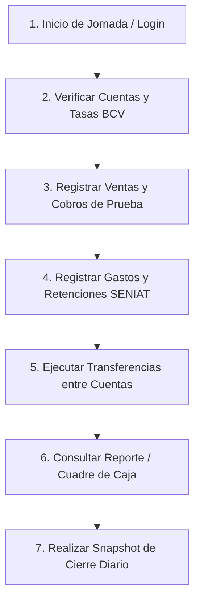

# RUNBOOK OPERATIVO DEL LABORATORIO DE CAMPO (V3.1)
## Todo Eléctrico Valencia — Sistema de Tesorería y Flujo de Caja

---

### 1. Guía para el Personal de Campo y Administración

Este documento instruye al personal no técnico y administrativo sobre cómo participar en el **Piloto Continuo de 7 Días**.

---

### 2. Acceso y Autenticación
1. Ingresar a la URL oficial del entorno de laboratorio:
   👉 **`https://tev-tesoreria-prod.onrender.com`**
2. Iniciar sesión con las credenciales de prueba asignadas a su rol (`cajera`, `administradora`, o `directivo`).
3. Verificar que el encabezado del sistema muestre claramente su nombre y sede asignada (**Sede Principal - Valencia Centro**).

---

### 3. Reglas de Oro del Piloto
- **REGLA 1 (Cero Datos Reales)**: No ingresar números de cédula, RIF, nombres de clientes ni montos bancarios reales de la empresa. Utilizar nombres genéricos de prueba (ejemplo: *Cliente Simulado 01*, *Proveedor Laboratorio A*, *Factura LAB-001*).
- **REGLA 2 (Reporte de Dificultades)**: Si una pantalla es lenta, confusa, pide pasos innecesarios o no tiene un campo que usted acostumbra a usar en su trabajo diario, anótelo de inmediato.
- **REGLA 3 (Manejo de Errores)**: Si el sistema muestra un mensaje de alerta (ejemplo: documento duplicado, fondos insuficientes o sesión expirada), tome una captura de pantalla y registre la hora exacta.

---

### 4. Flujo Diario de Operación (Paso a Paso)

---

### 5. Cómo Registrar una Incidencia de Usabilidad o Lógica
Si detecta una anomalía, complete la ficha:
- **Día del Piloto**: (Día 1 al 7)
- **Módulo**: (Ventas, CxC, Gastos, Bancos, Reportes)
- **¿Qué intentó hacer?**: Descripción en lenguaje sencillo.
- **¿Qué ocurrió?**: Mensaje de pantalla o comportamiento inesperado.
- **Sugerencia de Mejora**: ¿Cómo le gustaría que funcione?
